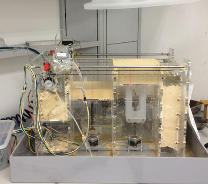
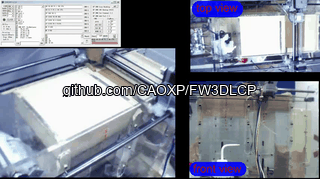
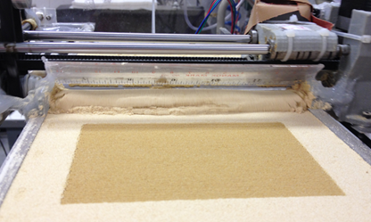
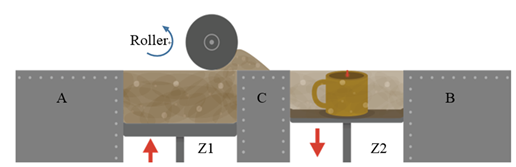
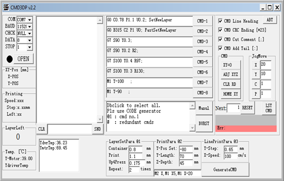

# 粉末床式磷酸镁水泥打印机 (Powder-bed MPC 3D Printer)


## 📖 项目简介 (Project Overview)

本项目是一个专为制造**磷酸镁基水泥 (MPC) 产品**而设计的**粉末床式磷酸镁水泥打印机 (Powder-bed MPC 3D Printer)**。该系统集成了基于 Arduino 的底层控制固件、专用的上位机控制软件 (CMD3DP v2.2) 以及定制的机械与流体挤出结构，实现了从粉末铺设、材料原位反应到三维成型的全链路控制。


*图 1：粉末床式磷酸镁水泥打印机完整产品图*

---

## 🔬 核心材料：磷酸镁基水泥 (MPCs)

本材料为 **磷酸材料为 **磷酸镁基水泥 (Magnesium phosphate-based cements, MPCs)**。

### 1. 反应原理 (Principle Reaction)
MPCs 的成型机制是煅烧氧化镁与磷酸或磷酸盐之间的**全溶液酸碱反应 (Through solution acid reaction)**。
- **常用磷酸盐 (Phosphates)**: `(NH4)H2PO4`, `(NH4)2HPO4`, `KH2PO4`, `NaH2PO4`
- **主要化学方程式**:
  ```text
  MgO + XPO4 + H2O  →  MgXPO4•nH2O   或   Mg(X2PO4)2•nH2O
  ```
  *(其中 X 可以是 H, NH4, 或碱金属)*

### 2. 宏观性能优势 (Macro Performance)
利用本打印机制造的 MPC 基产品具有以下显著优势：
- ⚡ **Rapid setting** (快速凝固)
- 📉 **Low drying shrinkage** (低干燥收缩)
- 💪 **High early strength** (高早期强度)
- 🔗 **Good bonding strength** (良好的粘结强度)
- 🛡️ **Good resistance to abrasion** (良好的耐磨性)
- 🏗️ **Good protection to steel rebar** (对钢筋有良好的保护作用)

---

## 🖨️ 打印效果展示 (Printing Effect)

得益于 MPC 材料的快速凝固特性和系统的高精度多轴控制，打印出的结构件具有极高的成型质量和早期强度。

**🎥 机器实际工作演示：**
本项目附带的打印全过程动图演示：



*(如果动图未加载或需要查看高清原视频，请[👉 点击这里下载或播放原始 WMV 视频](./assets/printing_process_demo.wmv))*


*图 2：MPC 基材料的 3D 打印实物效果图*

---

## ⚙️ 系统架构与工作原理 (System Architecture)

系统通过上位机软件与打印机控制板的协同，完成粉末铺设与粘结剂的精确喷射。整个控制架构形成了一个从数字模型到物理实体的闭环：

### 1. 硬件与控制架构
- **上位机 (Computer System & Monitor Software)**：通过 **G-code** 协议与下位机进行双向通信，负责打印任务下发与状态监控。
- **下位机固件 (3D Printer Firmware)**：运行在 Arduino 控制板上，解析 G-code 并驱动各执行机构。
- **多轴运动系统**：包含 `X 轴`, `Y 轴`, `Z1 轴` (供粉缸 Container), `Z2 轴` (打印缸 Print), 以及 `R 轴`。
- **挤出系统**：由压缩空气 (Compressed Air)、减压阀 (Reducing valve)、粘结剂容器 (Binder Container) 和喷嘴 (Nozzle) 组成，负责将反应液体（如磷酸盐溶液）精确滴涂在 MPC 粉末床上。

### 2. 粉末床打印原理

*图 4：打印原理图（侧视图），展示了平整的铺粉过程与粉末床结构*

在打印过程中，Z1 轴（供粉缸）上升提供粉末，刮平机构将粉末平铺至 Z2 轴（打印缸）上。随后喷嘴在 X/Y 轴的带动下，按照切片路径喷射溶液，与粉末床中的 MgO 发生快速凝固反应，逐层堆叠成型。

---

## 🖥️ 上位机控制软件 (CMD3DP v2.2)

上位机是人机交互的核心，专为粉末式打印流程深度定制。其源代码与可执行程序位于项目的 `cmd3dp/` 目录中。


*图 5：CMD3DP v2.2 控制软件界面*

### 软件技术栈与源码结构
上位机软件采用经典稳定的 **Visual Basic 6.0 (VB6)** 开发，依赖 `MSComm32.ocx` 控件实现与底层 Arduino 的串口通信。
- 📦 **`cmd3dp/CXP-CMD-3DP-V2.2.exe`**: 已编译好的可执行程序，可直接双击运行（绿色免安装）。
- ⚙️ **`cmd3dp/cmdcfg.ini`**: 软件初始化配置文件，用于保存上一次设定的指令参数和默认波特率。
- 💻 **`cmd3dp/vbcode/`**: VB6 核心源代码目录。
  - `comm.vbp` / `comm.vbw`: VB6 工程入口文件。
  - `frmmaim.frm`, `Form1.frm` 等: 包含人机交互 UI 窗体逻辑。
  - `functions.bas`, `Variables.bas` 等: 封装了 G-code 生成、通信协议校验与全局变量状态管理的纯代码模块。

### 核心功能面板：
- **打印参数配置 (Code Generator)**：
  - **LayerSetPara (@1)**：粉末容器 (Container)、打印平台 (Print)、抬升距离 (Up4Press) 及重复铺粉次数的精密控制。
  - **PrintPara (@2)**：设置打印的 Y 轴初始位置、Y 轴打印长度及 Z 轴深度。
  - **LinePrintPara (@3)**：设置线间距（Y-Step）与打印头移动速度（X-Speed）。
- **实时状态监控**：实时监控打印进度、Y轴电机温度 (YmtrTmp) 和驱动器温度 (YdvrTmp)。

---

## 🛠️ 下位机固件架构 (Arduino 源码)

固件部分（位于 `SRC/` 目录）采用模块化设计，基于 `AccelStepper` 库实现精准的多轴协同：

| 核心模块/文件 | 功能描述 |
| --- | --- |
| `FW3DLCP.ino` | 主程序入口，负责系统初始化、硬件引脚配置与主循环任务调度。 |
| `Powder_0.cpp/h` | **粉末管理核心**：负责粉末容器与打印平台的铺粉逻辑控制。 |
| `motor_*.cpp/h` | **运动控制核心**：处理多轴步进电机的加减速与精确定位。 |
| `ui_temperature.cpp/h` | **温度监控模块**：采集硬件温度，保障设备安全。 |
| `ui_paraSerialCommand.cpp/h` | **指令解析器**：接收上位机发送的变种 G-code 指令并执行动作。 |

---
*🔬 致力于通过 3D 打印技术推动新型结构材料 (MPC) 的创新与应用。*